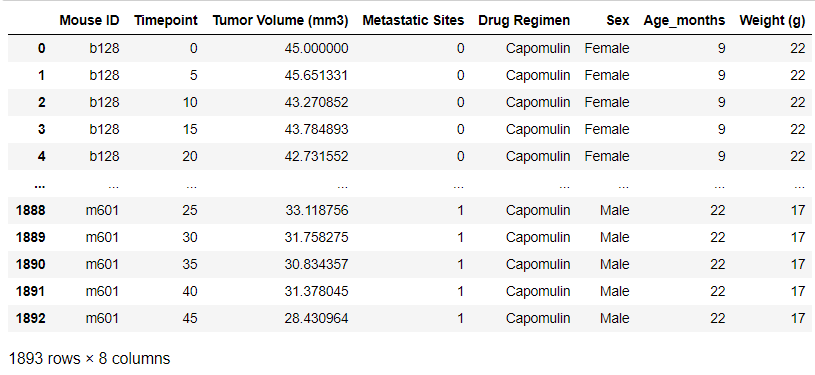

## Pharma Analysis / Matplotlib-based scope

# By Erick Hernandez

For example graphs, please check Results folder

In this project, I carried out an analysis regarding the results of pharmaceuticals applied to a group of mice for tumor and metastatic tracking over a period.

The language used for this project was Python, written with Jupyter Notebooks.

Data analysis involved the creation of two different Pandas DataFrames that contained the ID and metadata for the mice population and the study results. After performing a join for these frames, data cleansing involved eliminating duplicated records that could affect further analysis and conclusions.

I had to calculate central tendency measures (mean, variance, median, standard deviation and standard error of the mean) for each of the ten treatments using Numpy and Scipy.stats.
After creating an individual DataFrame for each treatment out of a GroupBy object, I created a bar plot for monitoring the number of mice exposed in a given timepoint.
  

Further analysis involves the identification of the mice population, tracking of a specific treatment and statistical analysis for certain treatments.

Finally, a correlation analysis was performed between the weight of the mice and the tumor size for a given treatment.

Results enabled me to identify the best available treatments based on results of a full analysis based on metrics and measures.

